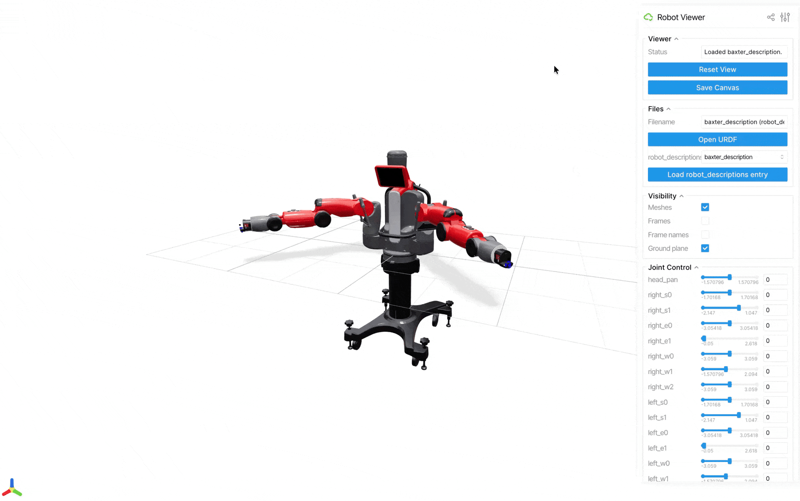
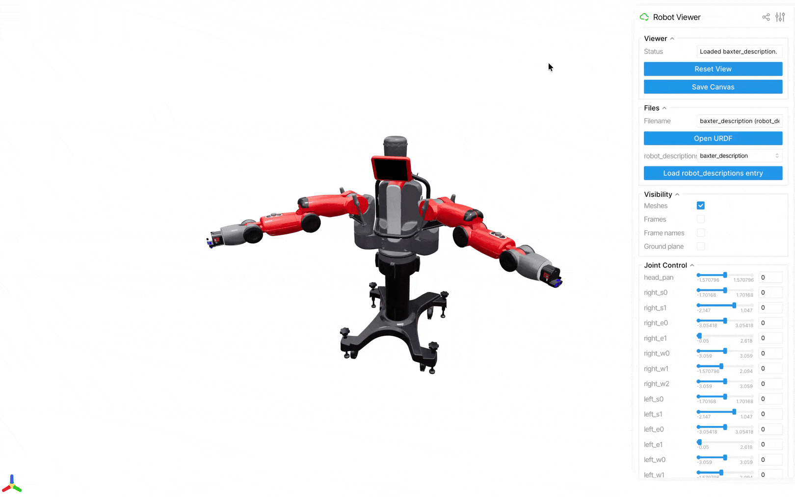

<p align="center">
  
</p>
<h1 align="center">Robot Viewer (rv)</h1>


`rv` is a simple web-based robot viewer powered by [Viser](https://viser.studio/main/). 

*Disclaimer: I use AI in developing this tool. Please use it at your discretion.*

## Features
- Visualize robot models in 3D. Supported format: [URDF](https://wiki.ros.org/urdf).
- Interact with the robot via joint and Cartesian controls (powered by [pink](https://github.com/stephane-caron/pink)).
- Access 100+ robot models from [robot_descriptions.py](https://github.com/robot-descriptions/robot_descriptions.py).

## Getting Started

1. Clone this repository:
    ```shell
    git clone https://github.com/zixingjiang/robot-viewer.git
    ```

2. Choose a package manager. `rv` can be easily run using either [uv](https://docs.astral.sh/uv/getting-started/installation/) or [pixi](https://pixi.prefix.dev/latest/installation/). Use the one you prefer.
   
    >[!Important]
    >For Windows users, please use pixi as pink cannot be installed on Windows via uv at the moment (Refs: [stephane-caron/pink#138](https://github.com/stephane-caron/pink/issues/138), [stack-of-tasks/pinocchio#2486](https://github.com/stack-of-tasks/pinocchio/issues/2486)).

3. Change directory to the project root, and launch the viewer. The package manager should take care of installing the dependencies for you. You can use the `--help` flag to see the available CLI options.
   
    ```shell
    cd robot-viewer
    uv run rv         # if you choose uv
    pixi run rv       # if you choose pixi
    ```

4. (optional) If you'd like to launch the viewer on a different directory other than the project root, you can install `rv` as a global tool (uv only):
   
    ```shell
    uv tool install -e /path/to/robot-viewer
    ```

    pixi does not have the exact quivalent. A workaround is add an alias to your shell configuration file:
    ```shell
    alias rv="cd /path/to/robot-viewer && pixi run rv"
    ```

## Usage

| Action                                                                                                                                      | Demo                              |
| ------------------------------------------------------------------------------------------------------------------------------------------- | ------------------------------------ |
| View local file<br><br><i>Note: Your local file stays on your machine. It won't be uploaded to the Internet.                                  |           |
| View robot from `robot_descriptions`<br><br><i>Note: Internet connection is required to fetch the robot models from their respective repositories.</i> |             |
| Visibility control                                                                                                                          |  |
| Joint control                                                                                                                               |       |
| Cartesian control<br><br><i>Note: Turning on Cartesian control will disable joint control.</i>                                                         |   |
    
## License
This repository is released under the [MIT License](LICENSE). 
