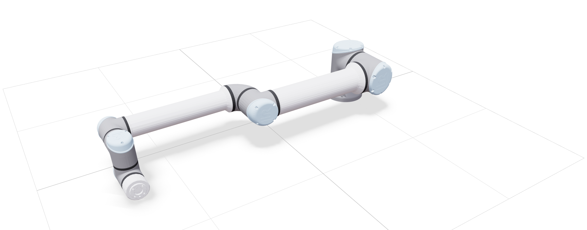
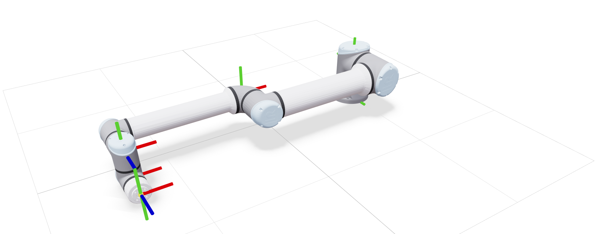
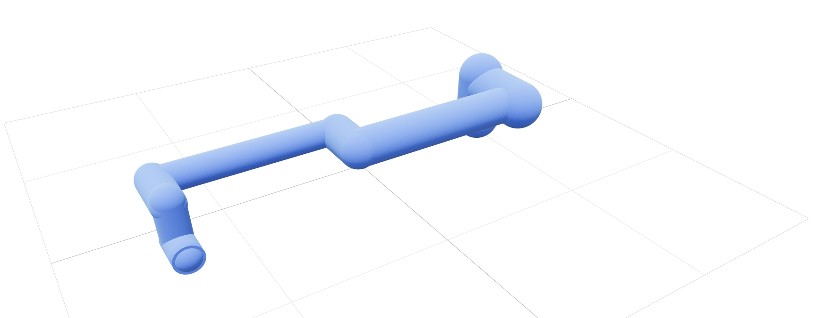
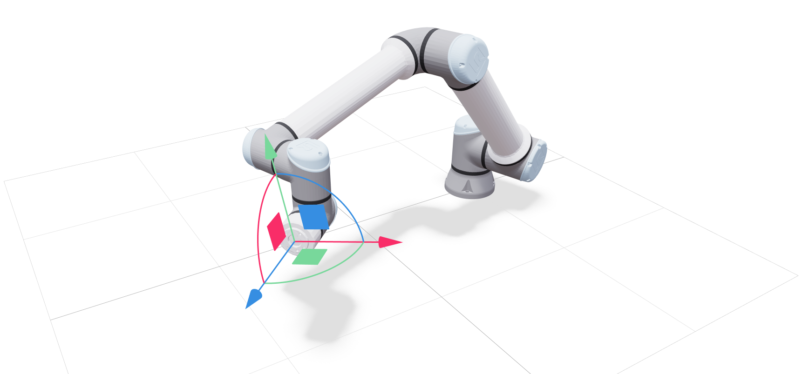

<p align="center">
  
</p>

# Robot Viewer

This repository contains `rv`, a simple web-based robot viewer built on [Viser](https://viser.studio/main/).

## Features

- Visualize robot models in 3D — supports [URDF](https://wiki.ros.org/urdf) and [MJCF](https://mujoco.readthedocs.io/en/stable/modeling.html).
- Interact with robots through joint-space and Cartesian controls, powered by [mink](https://github.com/kevinzakka/mink).
- Access a library of 175+ robot models from [robot_descriptions](https://github.com/robot-descriptions/robot_descriptions.py), including those from the [mujoco_menagerie](https://github.com/google-deepmind/mujoco_menagerie).
- Cross-platform: runs on Linux, macOS, and Windows — no ROS installation required.

## Quick Start

It is recommended to run `rv` with [uv](https://docs.astral.sh/uv/getting-started/installation/).

- Run on the fly (no install):
    ```shell
    uvx --from git+https://github.com/zixingjiang/robot-viewer rv 
    ```

- Install:
    ```shell
    uv tool install git+https://github.com/zixingjiang/robot-viewer 
    ```
    This installs the `rv` command on your system, which can be uninstalled with 
    ```shell
    uv tool uninstall robot-viewer
    ```

- Clone & run:
    ```shell
    git clone https://github.com/zixingjiang/robot-viewer.git
    cd robot-viewer
    uv run rv
    ```

Pass `--help` to `rv` to see all available CLI options.

## Gallery

| Visual | Frames |
|:---:|:---:|
|  |  |
| **Collision** | **Inverse Kinematics** |
|  |  |

## Acknowledgements

- `rv` draws inspiration from many excellent projects from the community, including [urdf-viz](https://github.com/openrr/urdf-viz), [pink](https://github.com/stephane-caron/pink), and [mjviser](https://github.com/mujocolab/mjviser).
- AI tools are used in the development of this codebase.

## License

This repository is released under the [MIT License](LICENSE).
