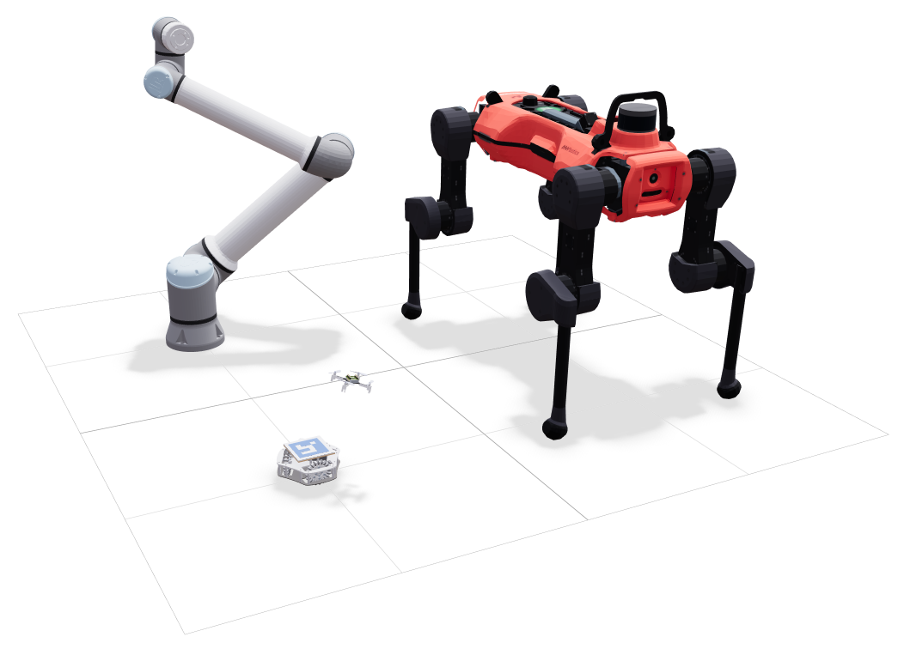

<p align="center">
  
</p>

# Robot Viewer
This repository contains `rv`, a simple web-based robot viewer powered by [Viser](https://viser.studio/main/).

## Features
- Visualize robot models in 3D with support for [URDF](https://wiki.ros.org/urdf) and [MJCF](https://mujoco.readthedocs.io/en/stable/modeling.html).
- Interact with robots through joint‑space and Cartesian controls, powered by [pink](https://github.com/stephane-caron/pink) and [mink](https://github.com/kevinzakka/mink).
- Access a library of 175+ robot models from [robot_descriptions](https://github.com/robot-descriptions/robot_descriptions.py), including those from the [mujoco_menagerie](https://github.com/google-deepmind/mujoco_menagerie).

## Getting Started
It's recommended to use a package manager to run `rv`, as it will take care of installing the dependencies for you. `rv` supports either [uv](https://docs.astral.sh/uv/getting-started/installation/) or [pixi](https://pixi.prefix.dev/latest/installation/). Use the one you prefer.

>[!Important]
>For Windows users, please use pixi as pink cannot be installed on Windows via uv at the moment (Refs: [stephane-caron/pink#138](https://github.com/stephane-caron/pink/issues/138), [stack-of-tasks/pinocchio#2486](https://github.com/stack-of-tasks/pinocchio/issues/2486)).


Follow the instructions below to get started:

1. Clone and change directory to this repository:
    ```shell
    git clone https://github.com/zixingjiang/robot-viewer.git
    cd robot-viewer
    ```

2. Launch the viewer. The package manager will handle dependency installation on the first run. You can use the `--help` flag to see the available CLI options.
   
    ```shell
    uv run rv       # if you use uv
    pixi run rv     # if you use pixi
    ```

3. (optional) If you'd like to launch the viewer on a different directory other than the project root, you may install `rv` as a global tool (uv only):
   
    ```shell
    uv tool install -e /path/to/robot-viewer
    ```

    pixi does not have the exact quivalent. A workaround is add an alias to your shell configuration file:
    ```shell
    alias rv="cd /path/to/robot-viewer && pixi run rv"
    ```

## Acknoledgement

## License
This repository is released under the [MIT License](LICENSE). 
