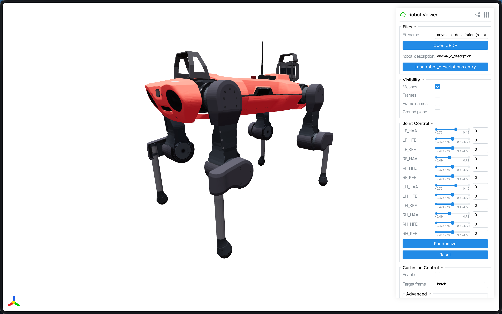
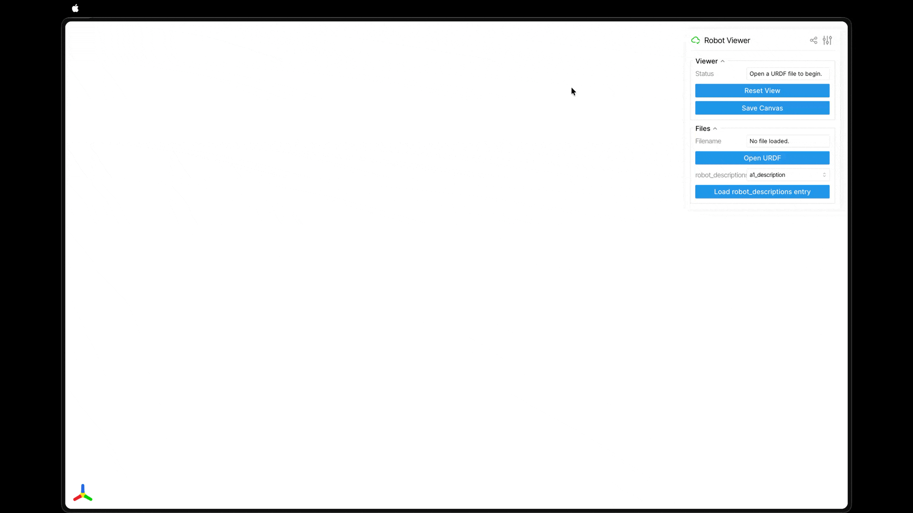
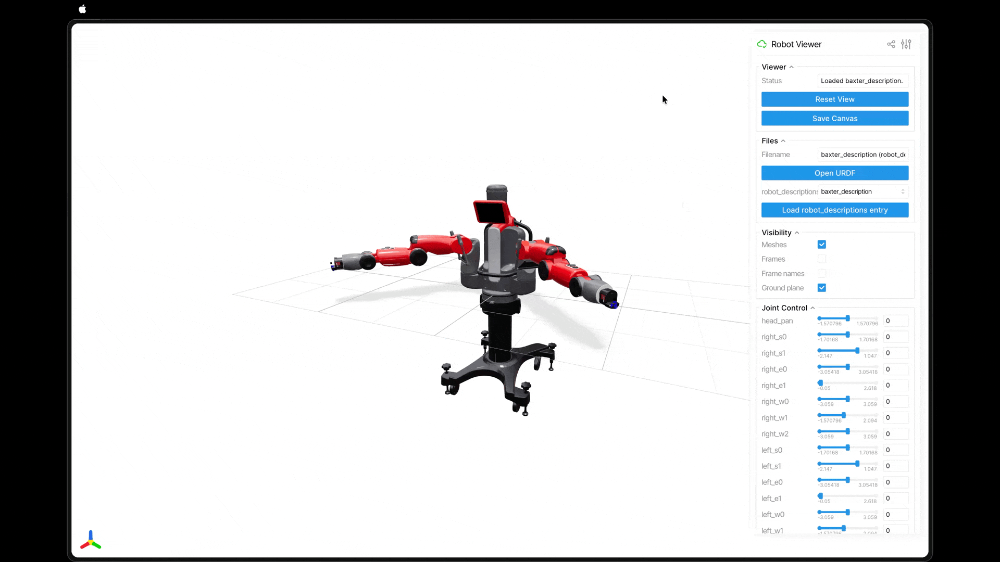
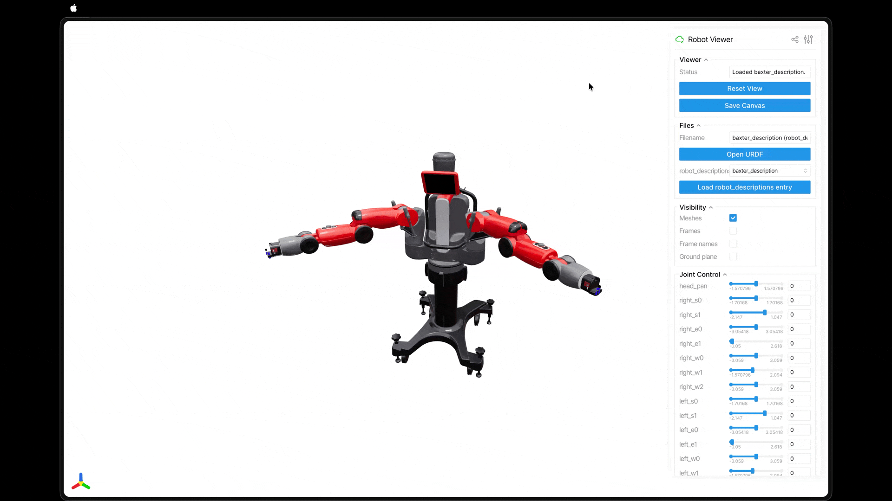
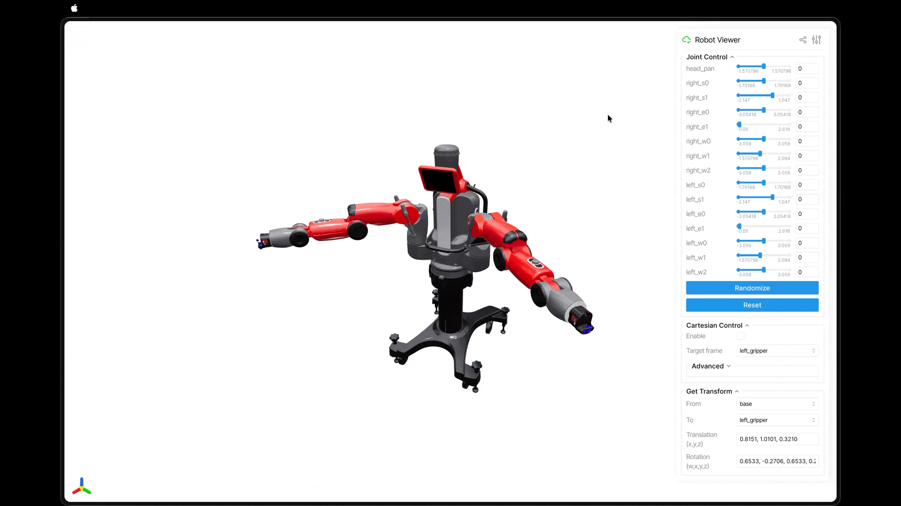

# `rv` - A simple web-based robot viewer powered by Viser 

This repository contains `rv`, a simple web-based robot viewer powered by [Viser](https://viser.studio/main/) . 


## Features
- Visualize robot models in 3D (currently only supports [URDF](https://wiki.ros.org/urdf) format).
- Interact with the robot via joint and Cartesian controls (powered by [pink](https://github.com/stephane-caron/pink)).
- Access 100+ robot models from [robot_descriptions.py](https://github.com/robot-descriptions/robot_descriptions.py).

## Getting Started
`rv` uses [uv](https://docs.astral.sh/uv/) for project management. To run `rv` without installing it, simply clone the repository and run the following command in the project directory:
```bash
uv run rv
```
The first run may take a while as it installs the required dependencies. After that, your browser will automatically launch and display the viewer interface.

### CLI

You can use the `-h` flag to view all available command‑line options.

### Installation

If you’d like to install `rv` so it’s available on your PATH, run the following command in the project directory:

```bash
uv tool install -e .
```

This allows you to run `rv` directly from anywhere in your terminal, without needing the `uv run` prefix.


## Usage
### View local URDF file
Note: Your local file stays on your machine. It won't be uploaded to Internet.



### View robot from robot_descriptions
Note: Internet connection is required to fetch the robot models from thier respective repositories.


### Visibility control


### Joint control


### Cartesian control
Note: Turn on Cartesian control will disable joint control.



## License
This repository is publically available under the [MIT License](LICENSE). 